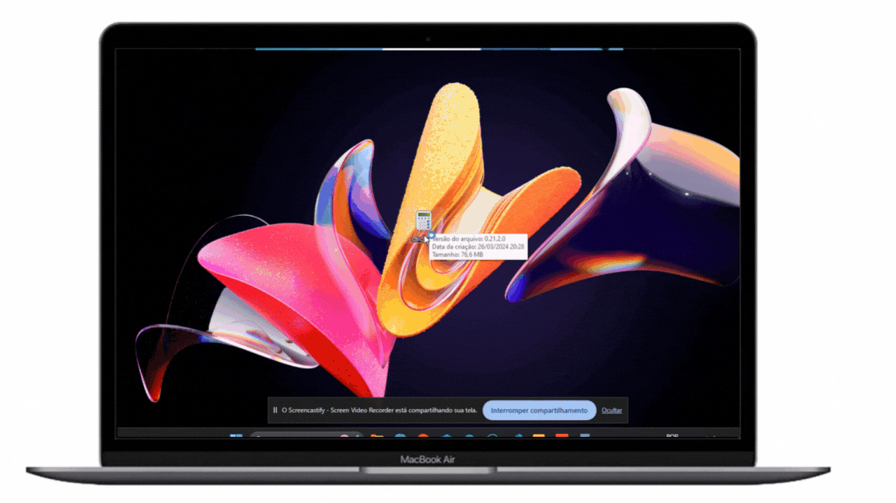

# Calculadora desenvolvida em PYTHON COM FLET

## Resumo do Projeto:  
Este projeto é uma calculadora desenvolvida em Python, utilizando a biblioteca gráfica Flet para a interface do usuário. A calculadora é capaz de realizar operações matemáticas básicas como adição, subtração, multiplicação, porcentagem e divisão.

O código foi escrito de maneira clara e eficiente, com funções bem definidas para cada operação. A interface do usuário é intuitiva e fácil de usar, com botões para cada número e operação.

## Criação do Executável   
O projeto foi empacotado em um arquivo executável usando o PyInstaller do Flet. Isso permite que o aplicativo seja executado em qualquer sistema Windows, sem a necessidade de instalar Python ou qualquer outra dependência.

Para executar o aplicativo, basta baixar o arquivo .exe e clicar duas vezes nele. Se o Windows Defender exibir uma mensagem de permissão, clique em “Mais informações” e depois em “Executar mesmo assim”. Link: https://mega.nz/file/2Qw0mTZa#tPgvyPG8nBONb5IHggu2wunMNZhFMC1IWbv52qg_X9k

## Conclusão  
Este projeto demonstra a eficácia do Flet para o desenvolvimento de aplicativos de desktop em Python. A capacidade de empacotar o aplicativo em um arquivo executável torna-o facilmente distribuível e acessível para usuários finais.

## Créditos
Programador Aventureiro: https://www.youtube.com/watch?v=rcMuTUpqUsU&list=PL9fkSENMuOu5d4Und33nsCMb1Zcyfpe_V&index=53